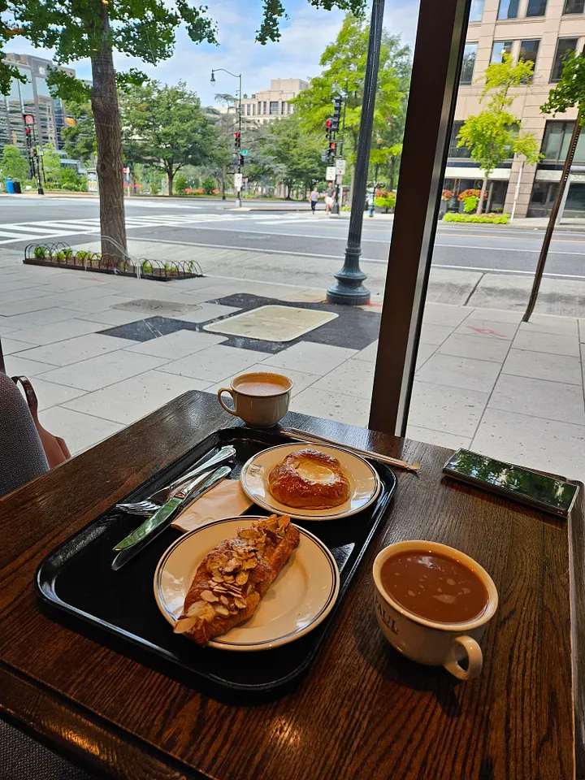

### Difficulty: Easy

**Challenge Info:**

Our target has been out and about, enjoying their (unwelcome) stay in the US. They just posted this picture. Can you determine where they are and submit the MAC address of the WiFi they're likely using?  
**Flag Format:** `C1{MAC}` or `C1{Address}`  
**Example:** 123 Street -> `C1{123}`

You are given this image to figure out the location or MAC address. Here's how to solve it:

**Step-by-Step Solution:**

1. **Analyze the Image:**
   - Notable clues: "Paul" on the coffee cup, a bakery-like store selling pastries, coffee, etc.
   - Visible elements: a clock on a building near the left side, a lamp post, and a tree with metal arches near the shop.

2. **Initial Search:**
   - Use Google Maps or Google Image Search with the query "Paul Pastries Coffee Shop."

3. **Narrow Down the Location:**
   - The search leads to 'Paul - French Bakery & Cafe.' Verify the location by matching the building and street view with the image.
   - The correct location is **1275 K St NW, Washington, DC 20005**.

4. **Submit the Address:**
   - The flag for the address is `C1{1275}`.

5. **Find the MAC Address:**
   - Use a wardriving database like [Wigle.net](https://wigle.net/).
   - Search for the address on Wigle.net to find the WiFi MAC address. You might need to create an account if you hit the daily limit.
   - The MAC Address found is **6C:CD:D6:BD:5B:61**.

6. **Submit the MAC Address:**
   - The flag for the MAC address is `C1{6C:CD:D6:BD:5B:61}`.

