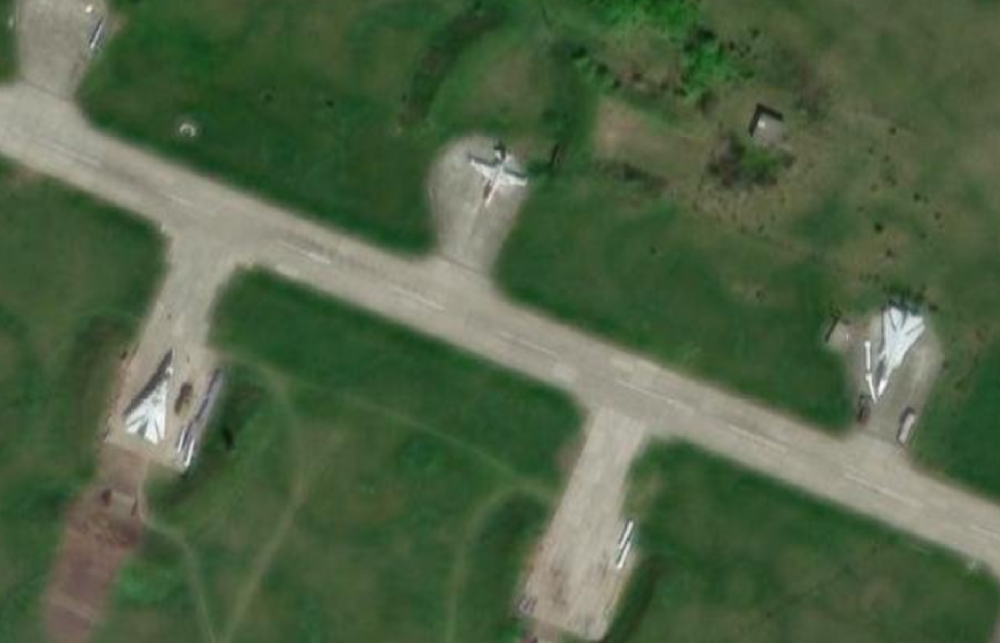

# Medium Difficulty Challenge

## Challenge Info

Our target, who is still at large, left a dead-drop in a nearby park containing some unlabeled imagery. We have attached the images here, hoping you can identify the location's ICAO code. This location might be relevant to an upcoming operation or the target themselves.

### Flag format: C1{ICAO}

**Author:** nord

## What is an ICAO Code?

The ICAO airport code, or location indicator, is a four-letter code designating aerodromes around the world. These codes, defined by the International Civil Aviation Organization, are used by air traffic control and airline operations such as flight planning.

## Task

You are given two images to determine the ICAO code. 

### Image Analysis

1. **First Image:** 
   - The photo appears to be an aerial view looking down on a field.

2. **Second Image:**
   - The photo resembles a military base with military aircraft on standby.

### Investigation

Using Google reverse image search, it appears that the images are related to the conflict between Russia and Ukraine. To narrow down the location, further investigation led to a tweet mentioning the Starokonstantinov airbase. The images closely match those found in the tweet.

- **Tweet:** [Narrative_Hole's Tweet](https://x.com/narrative_hole/status/1688015540365717505)

Searching for the ICAO code for Starokonstantinov airbase confirms the match.

### Solution

The ICAO code for Starokonstantinov airbase is **UKLS**. Thus, the flag is:

**Flag:** C1{UKLS}
